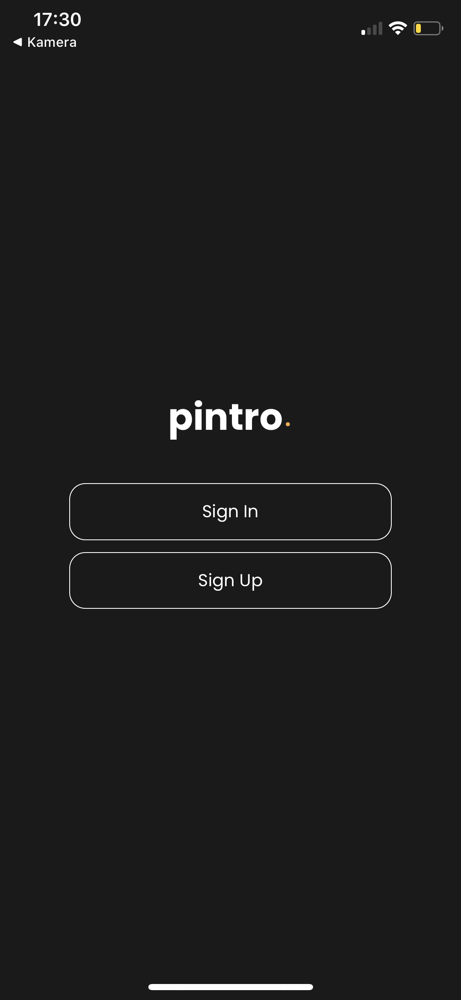
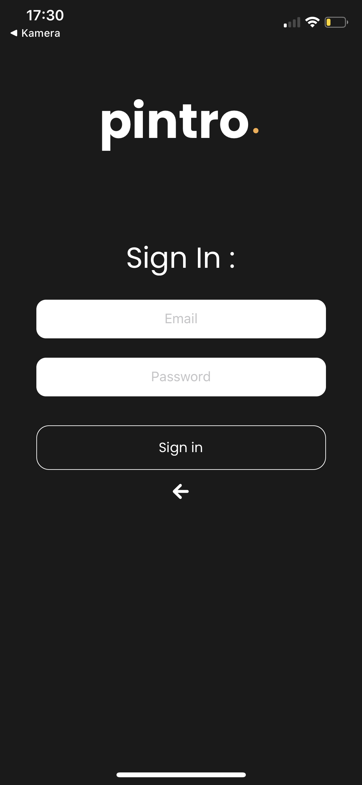
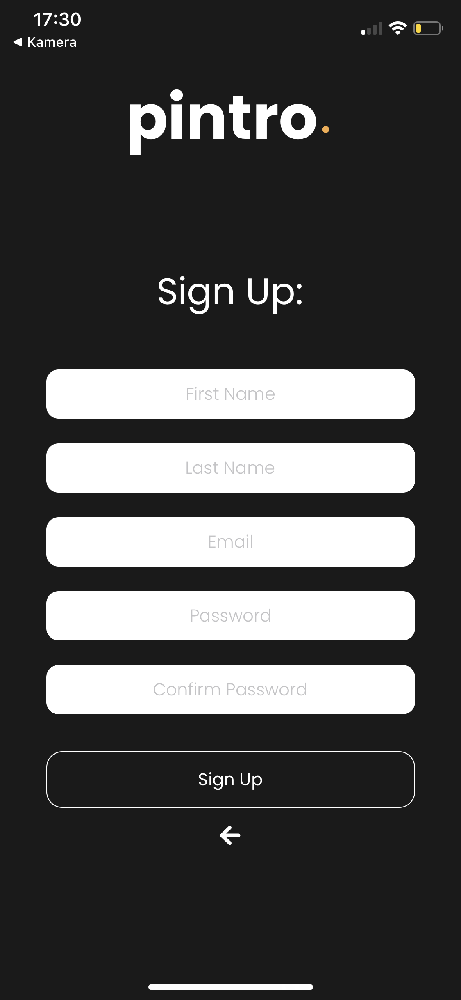

**Basic Structure for the project**

Basic structrue to start the work. Created with `expo init Pintro`   
To run it, clone it to your local machine, then  
 `cd Pintro`   
 `npm install`  
 `npm start`  
 Requires an up-to-date version of Node.js and npm.
 

Uses following Packages:  
1) ` react-native-animatable": ^1.3.3 `  
2) `react-native-keyboard-aware-scroll-view": "^0.9.1`

----------------------------------------

1) For animations
2) To make the views move if the keyboard hides them

-----------------

**Images:**

